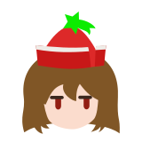
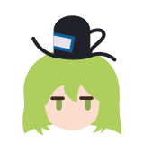
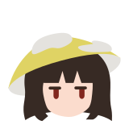

# Touhou Katsujishotai

by [/u/RebeccaRGB](https://www.reddit.com/user/RebeccaRGB/) with artwork by [/u/plasticparakeet](https://www.reddit.com/user/plasticparakeet).

Touhou Katsujishotai is a TrueType font with embedded color images, like emoji fonts, except instead of emoji it contains flat-style sprites of Touhou characters. The version named **TouhouKatsujishotai.ttf.sbix.ttf** works only with Mac OS X 10.8 Mountain Lion or later. The version named **TouhouKatsujishotai.ttf.svg.ttf** will work with Mozilla Firefox and will soon work with Adobe CC and Windows 10.

Katsujishotai (hiragana: かつじしょたい, kanji: 活字書体) means "typeface" according to EDICT.

The font was generated by FontForge, but since FontForge does not support embedded color images, they had to be injected into the generated font using [Kreative BitsNPicas](https://github.com/kreativekorp/bitsnpicas).

Touhou Katsujishotai contains artwork by [/u/plasticparakeet](https://www.reddit.com/user/plasticparakeet).

The list of sprites included in the font and how to type them follows. Gaps in the Unicode mapping are ~~Yukari fooling around again~~ for PC98 and manga characters which are not included yet.

| Keyboard Mapping | Unicode Code Point | My Touhous!
| ---------------- | ------------------ | -----------------------------------
|        r         |        F000        |  Reimu Hakurei
|        m         |        F001        |  Marisa Kirisame
|        7         |        F020        |  Rumia
|        8         |        F021        |  Daiyousei
|        9         |        F022        |  Cirno
|        h         |        F023        |  Hong Meiling
|        k         |        F024        |  Koakuma
|        p         |        F025        |  Patchouli Knowledge
|        s         |        F026        |  Sakuya Izayoi
|        d         |        F027        |  Remilia Scarlet
|        f         |        F028        |  Flandre Scarlet
|        l         |        F029        |  Letty Whiterock
|        c         |        F02A        |  Chen
|        a         |        F01B        |  Alice Margatroid
|        0         |        F02B        |  Lily White
|        \[        |        F02C        |  Lyrica Prismriver
|        \\        |        F02D        |  Merlin Prismriver
|        \]        |        F02E        |  Lunasa Prismriver
|        o         |        F02F        |  Youmu Konpaku
|        y         |        F030        |  Yuyuko Saigyouji
|        x         |        F031        |  Ran Yakumo
|        z         |        F032        |  Yukari Yakumo
|        5         |        F037        |  Wriggle Nightbug
|        6         |        F038        |  Mystia Lorelei
|        q         |        F039        |  Keine Kamishirasawa
|        w         |        F03A        |  Keine Kamishirasawa EX
|        t         |        F03B        |  Tewi Inaba
|        u         |        F03C        |  Reisen Udongein Inaba
|        e         |        F03D        |  Eirin Yagokoro
|        g         |        F03E        |  Kaguya Houraisan
|        j         |        F03F        |  Fujiwara no Mokou
|        i         |        F040        |  Suika Ibuki
|        1         |        F041        |  Sunny Milk
|        2         |        F042        |  Luna Child
|        3         |        F043        |  Star Sapphire
|        M         |        F044        |  Medicine Melancholy
|        A         |        F045        |  Aya Shameimaru
|        Y         |        F016        |  Yuuka Kazami
|        K         |        F046        |  Komachi Onozuka
|        E         |        F047        |  Eiki Shiki
|        Z         |        F04C        |  Shizuha Aki
|        X         |        F04D        |  Minoriko Aki
|        H         |        F04E        |  Hina Kagiyama
|        N         |        F04F        |  Nitori Kawashiro
|        J         |        F050        |  Momiji Inubashiri
|        S         |        F051        |  Sanae Kochiya
|        Q         |        F052        |  Kanako Yasaka
|        W         |        F053        |  Suwako Moriya
|        n         |        F054        |  Iku Nagae
|        b         |        F055        |  Tenshi Hinanawi
|        I         |        F056        |  Kisume
|        V         |        F057        |  Yamame Kurodani
|        P         |        F058        |  Parsee Mizuhashi
|        G         |        F059        |  Yuugi Hoshiguma
|        <         |        F05A        |  Satori Komeiji
|        R         |        F05B        |  Rin Kaenbyou
|        U         |        F05C        |  Utsuho Reiuji
|        >         |        F05D        |  Koishi Komeiji
|        C         |        F05E        |  Nazrin
|        T         |        F05F        |  Kogasa Tatara
|        F         |        F060        |  Ichirin Kumoi
|        D         |        F061        |  Minamitsu Murasa
|        O         |        F062        |  Shou Toramaru
|        B         |        F063        |  Byakuren Hijiri
|        L         |        F064        |  Nue Houjuu
|        v         |        F065        |  Hatate Himekaidou
|        !         |        F067        |  Kyouko Kasodani
|        @         |        F068        |  Yoshika Miyako
|        #         |        F069        |  Seiga Kaku
|        $         |        F06A        |  Soga no Tojiko
|        %         |        F06B        |  Mononobe no Futo
|        ^         |        F06C        |  Toyosatomimi no Miko
|        &         |        F06D        |  Mamizou Futatsuiwa
|        *         |        F06F        |  Hata no Kokoro
|        ~         |        F070        |  Wakasagihime
|        \`        |        F071        |  Sekibanki
|        /         |        F072        |  Kagerou Imaizumi
|        {         |        F073        |  Benben Tsukumo
|        }         |        F074        |  Yatsuhashi Tsukumo
|        ,         |        F075        |  Seija Kijin
|        .         |        F076        |  Shinmyoumaru Sukuna
|        \|        |        F077        |  Raiko Horikawa
|        ?         |        F078        |  Sumireko Usami
|        '         |        F079        |  Seiran
|        "         |        F07A        |  Ringo
|        ;         |        F07B        |  Doremy Sweet
|        :         |        F07C        |  Sagume Kishin
|        4         |        F07D        |  Clownpiece
|        -         |        F07E        |  Junko
|        _         |        F07F        |  Hecatia Lapislazuli
|        (         |        F080        |  Cirno (with a tan)
|        )         |        F081        |  Eternity Larva
|        =         |        F082        |  Nemuno Sakata
|        +         |        F083        |  Aunn Komano
|       oops       |        F084        |  Narumi Yatadera
|        we        |        F085        |  Mai Teireida
|       ran        |        F086        |  Satono Nishida
|        out       |        F087        |  Okina Matara
|        of        |        F088        |  Joon Yorigami
|       keys       |        F089        |  Shion Yorigami
